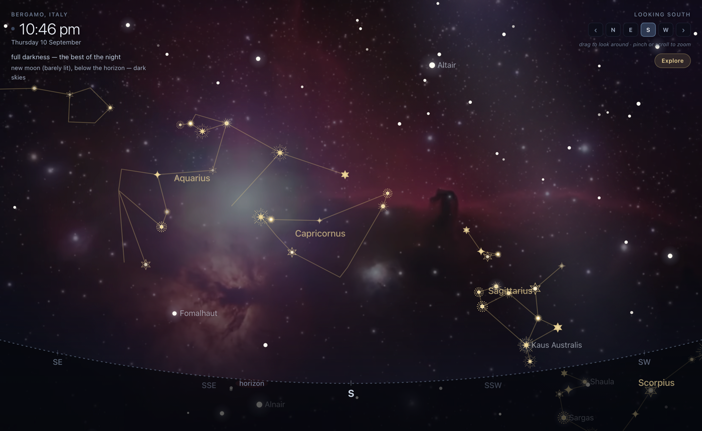

# Tales from the Stars

A live, naked-eye view of the night sky, built for an educational project that pairs
each constellation with its mythology and history.

You are standing outside, facing a compass direction. The horizon runs along the
bottom, stars sit above it, and the Milky Way runs where it really runs. Drag to look
around, pinch to zoom, and keep going past the horizon to find what has already set.
Click any constellation and the view turns to face it and tells you its story.

Default location is **Bergamo, Italy** (45.695° N, 9.670° E, Europe/Rome), but the
place can be changed to anywhere on Earth.

**Live: <https://roshnidesigns.github.io/Tales-from-Stars/>**



## Running it

It is live at <https://roshnidesigns.github.io/Tales-from-Stars/>, served straight
from `main` by GitHub Pages — `.nojekyll` keeps Jekyll from touching the static
files.

It opens on a **dark sky**, not on whatever the clock happens to say. Arriving at
three in the afternoon and being shown a washed-out blue sky is a poor introduction
to the constellations, so if it is not currently dark the view jumps to the coming
night — settling about ninety minutes after darkness falls, so the sky has risen
clear of the horizon murk. If it *is* already dark, nothing beats the real sky, so
live mode stays on and the clock keeps running. `Now` (or `N`) always returns to the
real moment, and `?t=` in the URL overrides the whole thing.

Two edge cases are handled rather than assumed away. Under a **midnight sun** there
is no dark moment to jump to, so it shows the darkest the sky will get and the
readout says plainly that it is still daylight. In **high summer at mid-latitudes**
full darkness genuinely arrives after midnight, so the date may read as tomorrow —
which is correct: that is tonight's sky.

Locally there is no build step and nothing to install.

```bash
python3 -m http.server 8000
```

Then open <http://localhost:8000>. Opening `index.html` directly from disk works too —
the star catalogue is loaded as a plain script (`data/catalog.js`) precisely so that
`file://` works, where browsers block `fetch()` of local JSON.

The only network request is the CDN copy of
[astronomy-engine](https://github.com/cosinekitty/astronomy), used for the Sun and
Moon. If it is unavailable the page falls back to compact built-in series and stays
fully usable — Sun altitude then agrees to within 0.005°, the Moon to about 1°, and
the reported Moon phase is unchanged.

## What you can do

The sky fills the window; everything else is an overlay that gets out of the way.

| | |
|---|---|
| **Look around** | Drag the sky, use `←` `→` `↑` `↓`, or the N/E/S/W buttons |
| **Zoom** | Pinch, scroll, or `+` / `-` — 25° to 160° field of view |
| **Look below the horizon** | Keep dragging down. Constellations that have already set stay drawn, dimmed under the ground, so you can go and find them |
| **Scrub time** | *Time* at the top of the **Explore** panel — night, then year |
| **Watch it move** | `Play` — up to a week a second, to see the seasonal handoff |
| **Back to now** | `Now`, or press `N` — it opens on tonight's dark sky, not the current hour |
| **Read a story** | Click a constellation or its name; double-click zooms in on it. `Esc` closes |
| **Browse them all** | The **Explore** button, top right |
| **Your sky** | City centre → dark countryside, which changes how many stars show |
| **Star glyphs** | Decorative glyphs on the figure stars, on by default |
| **Move location** | Anywhere on Earth, under *Where you are* |

Nothing sits over the sky but the clock in one corner and the compass in the other.
Every control — time, the constellation lists, what you can see, where you are — lives
in the **Explore** panel, which takes the right third and leaves the sky watchable
while you scrub. Hovering either slider names it and gives its value, and both keep an
accessible name for screen readers.

Because you can look anywhere on the sphere, the ground is drawn as a translucent
veil rather than an opaque floor — it darkens what is beneath you the way the Earth
would, without hiding it. Turn it off entirely under *What you can see*.

The view can also be set from the URL, which is how it is tested:

```
?t=2026-09-10T22:30      wall clock in the active zone (append Z for UTC)
?lat=45.695&lon=9.670    observer position
?tz=Europe/Rome          IANA time zone
?facing=180              compass direction to look towards
?pitch=28                how far up (or down, negative) to look
?fov=110                 field of view in degrees
```

## What it draws

**The twelve of the zodiac**, in **gold** — Aries, Taurus, Gemini, Cancer, Leo,
Virgo, Libra, Scorpius, Sagittarius, Capricornus, Aquarius, Pisces. Always listed in
the order the Sun travels through them, whether or not they happen to be up, because
the zodiac is the point of the project.

**The five that never set** from this latitude, in **grey-blue** — Ursa Major, Ursa
Minor, Cassiopeia, Cepheus, Draco. Above the horizon every night of the year.

**And the rest of the sky.** Every star down to magnitude 5.2 is drawn, all 2,072 of
them across all 88 constellations, so the 17 told constellations sit in a real sky
rather than floating in a void. Hover any star for its name; only the 17 have
stories behind them.

## The astronomy

Star positions are catalogued for epoch J2000 and drawn for the moment you are
looking at:

1. **Precession** from J2000 to the equinox of date (Lieske 1977 angles).
2. **Local sidereal time** from the Julian date and your longitude.
3. **Altitude and azimuth** from the hour angle `H = LST − RA`:
   `sin(alt) = sin δ sin φ + cos δ cos φ cos H`.
4. **Atmospheric refraction** (Bennett 1982), which lifts objects near the horizon
   by about half a degree — exactly where "is it up yet?" gets decided.

Cross-checked against astronomy-engine's independent implementation: above the
horizon the altitudes agree to **0.002°** and the azimuths to **0.006°**. The
precession routine matches its rotation matrix to within 12 arcseconds, the
difference being nutation, which this project does not model — about 1/70th of a
pixel on screen.

Nothing in the interface is expressed in degrees. Positions are rendered as
"high in the south-east" or "just clearing the horizon in the north-west", because
that is how you would say it to someone standing next to you.

### Projection

Stereographic, centred on wherever you are looking: angular distance `θ` from the
centre of view maps to a radius of `2·tan(θ/2)`. A plain perspective projection
stretches the corners badly at a 110° field of view, whereas this keeps
constellation shapes recognisable right out to the edge.

## Data sources

All open data. Nothing is scraped, and nothing is fetched live in the browser.

| What | Source | License |
|---|---|---|
| Star positions and magnitudes | [HYG Database v4.1](https://github.com/astronexus/HYG-Database) (`hygdata_v41.csv`) — merges Hipparcos, Yale Bright Star and Gliese | Public domain / CC0 |
| Constellation line figures | [Stellarium](https://github.com/Stellarium/stellarium) `skycultures/modern_iau/index.json`, keyed by HIP number | GPL-2.0-or-later |
| Sun and Moon | [astronomy-engine](https://github.com/cosinekitty/astronomy) | MIT |
| Mythology and history text | Written for this project | See LICENSE |

`data/stars.json` holds 2,072 stars: every star brighter than magnitude 5.2 anywhere
in the sky, plus every star used as a vertex in one of the 17 figures however faint.
Spot-checked against published J2000 positions — the reference stars agree to under
an arcsecond in declination and under two seconds in right ascension.

### Rebuilding the data

`data/*.json` and `data/catalog.js` are generated. To regenerate them, fetch the two
upstream files and run the build script:

```bash
curl -L -o /tmp/hyg.csv https://raw.githubusercontent.com/astronexus/HYG-Database/main/hyg/CURRENT/hygdata_v41.csv
curl -L -o /tmp/iau.json https://raw.githubusercontent.com/Stellarium/stellarium/master/skycultures/modern_iau/index.json

python3 tools/build_data.py --hyg /tmp/hyg.csv --iau /tmp/iau.json \
        --myths tools/mythology.json --glyphs tools/star-glyphs.json --out data
```

The 34 MB HYG catalogue is deliberately not committed — only the trimmed 17 kB
extract is. To edit or extend the stories, edit `tools/mythology.json` and re-run the
build; to add a constellation, add its abbreviation to `TARGETS` in
`tools/build_data.py` and give it an entry in `tools/mythology.json`.

## A note on licensing

The code and the mythology text are MIT (see `LICENSE`). The constellation *line
figures* in `data/constellations.json` derive from Stellarium's sky-culture data,
which is **GPL-2.0-or-later** — so that file carries the stronger obligation, not
MIT. The underlying IAU star groupings are standard astronomical fact rather than
anyone's creative work, so if the GPL is inconvenient for redistribution the line
lists can be rebuilt by hand from any IAU reference and the dependency drops away.
Flagging it rather than quietly relabelling everything MIT.

## Star glyphs

The figure stars of the **twelve zodiac** constellations wear a decorative gold
glyph. Everything else — the five circumpolar figures included — stays plain white
dots. The five keep their lines, names and stories; only the decoration is reserved
for the zodiac, so the twelve the project is actually about are the ones that stand
out, and the northern sky does not compete with them.

The system comes from `tools/star-glyphs.json`, supplied with the design. It defines:

- **`glyphOrder`** — a glyph id per star by brightness rank, `g4` (outer radius 180
  against everyone else's 100) going to the brightest star of each figure.
- **`glyphOuterRadius`** — collision radii in the glyph's own unit space.
- **the size curve** — `clamp(0.42 - (mag - 0.85) * 0.055, 0.16, 0.42)`.

Two things worth knowing about how it is applied:

**The ids are derived, not copied.** Sorting a figure's stars by magnitude and
indexing `glyphOrder` by `rank % 7` reproduces all 110 of the file's assignments
exactly, so the rule is applied to this project's own catalogue instead of matching
the file star by star. That keeps the more precise HYG positions, extends the system
to the constellations the file does not cover, and guarantees the intent — brightest
star always gets the big glyph. Where the two star selections coincide the ids agree;
where this project's IAU figures carry more vertices the ranks legitimately differ.

**The spec file carries no artwork**, only ids and radii; the artwork arrived
separately and lives in `assets/glyphs/` — see below.

Size follows the zoom, but only part way, and the same rule governs the star dots so
the picture scales as one rather than the decoration growing while the stars stay
put. Anchoring to a true angular size swells everything into blobs the moment you
zoom in; pinning to a fixed screen size leaves the sky crowded when pulled back,
which is the wider and denser view. So size tracks the zoom with a damped exponent
and hard limits at both ends.

Stars and glyphs take different floors, because they had different problems. The
glyphs were genuinely too big pulled back, so they may shrink to 0.8× below their
default — the largest is about 21px across at the widest field, 27px at the default,
40px closed in on one figure. The star dots never were, and the wide view is exactly
where you want to take in the whole sky, so they are floored at their current size:
they grow to 1.5× as you close in and never shrink. Turn glyphs off entirely under
*What you can see*.

### The artwork

`assets/glyphs/` holds the real glyphs, supplied as part of the design:

- `svg/g1.svg` … `g7.svg` — the source of truth. Square `viewBox="-200 -200 400 400"`,
  artwork centred on (0,0), paths only, single colour via `currentColor`.
- `png/g1.png` … — 512×512, transparent, white artwork, same centring.
- `README.md` — the design's own notes on each glyph.

The **PNGs are what actually get drawn**, for two reasons. An SVG loaded through an
`` is a separate document and cannot inherit `currentColor` from the page, so it
could not be tinted; and `` needs no `fetch`, so the artwork also works when
`index.html` is opened straight from disk, where fetching local files is blocked.

Tinting keeps the artwork's alpha and replaces its colour with a `source-in`
composite into an offscreen canvas, cached per id and colour — so it happens seven
times per palette rather than once per star per frame. The whole glyph layer costs
about a millisecond a frame for fifty-odd glyphs.

Sizing falls out of the shared canvas rather than needing per-glyph cases. All seven
are drawn on the same 400-unit canvas, and a glyph's outer radius is its
`glyphOuterRadius` in those units — so if 100 units is `r` pixels, the canvas is
always `4r` pixels square, whichever glyph it is. That is exactly how `g4` comes out
1.8× the others for free.

If a glyph file is missing or fails to load, `drawGlyph()` falls back to shapes drawn
in code, so the chart still works. To replace the artwork, drop in new files with the
same names, keeping the centring and keeping the padding consistent across all seven
(don't normalise each glyph to fill its own canvas, or they will all come out the
same size on screen).

## The backdrop

Behind the live sky runs a loop of deep-space footage, `assets/backdrop.mp4`, blurred
and semi-transparent. It fades out as the Sun rises so it never shows through a
daylit sky, holds still if you have asked for reduced motion, and can be switched off
under *What you can see*. `assets/nebula.jpg` is its poster, so a still shows while
the video loads and stands in if it cannot play at all.

A whisper of blur (0.8px) takes the hard edge off the footage's own painted stars,
which would otherwise read as a second star field competing with the real catalogue
drawn on top. What actually keeps the live stars dominant is that they are brighter,
carry a glow, and wear glyphs — so the backdrop can stay sharp and legibly itself.

### Cutting the loop down

The source footage is 1920×1080, forty minutes long, 909 MB — far past GitHub's
100 MB per-file limit. But a cut of it is small without giving up anything, because
`PresetPassthrough` copies the streams instead of re-encoding them: the loop is
bit-identical to the source at full 1920×1080. macOS can do this with nothing
installed:

```bash
avconvert --source videoplayback.mp4 --output assets/backdrop.mp4 \
          --preset PresetPassthrough --start 522 --duration 72 --replace
```

The shipped loop is 72 seconds for 26 MB, and it plays at **half speed** — set by
`BACKDROP_RATE` in `js/app.js`. Slowing it costs nothing, makes the drift calm enough
to sit behind a star chart without pulling the eye, and doubles how long the loop
takes to come round: 72 seconds of footage becomes a two-and-a-half-minute cycle.
That rate is the cheapest lever by far — reach for it before cutting a longer clip.

Two things worth knowing when choosing `--start`. Bitrate varies a lot by passage,
so where you cut changes the file size at identical quality: 90 seconds costs 26 MB
from one part of this footage and 47 MB from another. And the footage drifts between
a warm pink nebula and a cool blue one, with the pink stretch running only about
520–600s, so a longer cut can cross the transition and make the loop seam a visible
colour jump. Reach for a re-encoding preset (`Preset1280x720` and friends) only if
you actually want a smaller frame — they cost real quality, and can *raise* the
bitrate well above the source's.

Passthrough cuts land on keyframes, so the start may snap by a fraction of a second.
With ffmpeg available, a crossfade between the loop's head and tail would hide the
seam entirely.

`.gitignore` excludes `assets/*.mp4` with an exception for `backdrop.mp4`, so the
909 MB source can never be committed by accident while the loop still ships. Bear in
mind that every version of the loop you commit stays in git history for good — if you
plan to iterate on the footage a lot, better to keep it out of git and host it
somewhere else, pointing the `<video>` at that URL.

### The generated fallback plate

`assets/nebula.jpg` is generated, not downloaded — `tools/make_nebula.html` draws it
from seeded noise, so the repo carries no third-party artwork:

```bash
chrome --headless --window-size=2560,1440 --virtual-time-budget=6000 \
       --screenshot=nebula.png tools/make_nebula.html
sips -Z 1600 nebula.png --out small.png
sips -s format jpeg -s formatOptions 88 small.png --out assets/nebula.jpg
```

It contains no stars either, for the same reason as the blur. Downsampling to 1600px
is what removes the gradient dithering.

### Swapping the footage

Replace `assets/backdrop.mp4`, or point the `<video>` in `index.html` somewhere else.
`muted` and `playsinline` must stay or browsers will refuse to autoplay; if autoplay
is refused anyway, playback starts on the first tap or keypress.

## Layout

```
index.html               markup and the control panel
styles.css               dark star-chart styling
js/astro.js              time, precession, alt/az, refraction, Sun and Moon
js/sky.js                stereographic projection and all canvas drawing
js/app.js                state, interaction, and the plain-language layer
data/stars.json          trimmed HYG extract (217 stars)
data/constellations.json line figures plus the mythology content
data/catalog.js          generated: both payloads as globals, so file:// works
assets/backdrop.mp4      the backdrop loop
assets/nebula.jpg        generated poster / fallback plate
assets/glyphs/           star glyph artwork: svg source, png for rendering
tools/build_data.py      the build script
tools/mythology.json     the story content, edit this
tools/star-glyphs.json   the glyph spec: ids, radii, size curve
tools/make_nebula.html   draws the backdrop plate
```

## Accessibility

Every constellation is reachable by keyboard from the *Constellations* panel, and
each row carries a text description of where it currently is — "high in the
south-east", "below you" — so the sky has a spoken equivalent rather than being
canvas-only. `prefers-reduced-motion` turns off twinkling, the backdrop drift, and
the animated turn-to-face.
